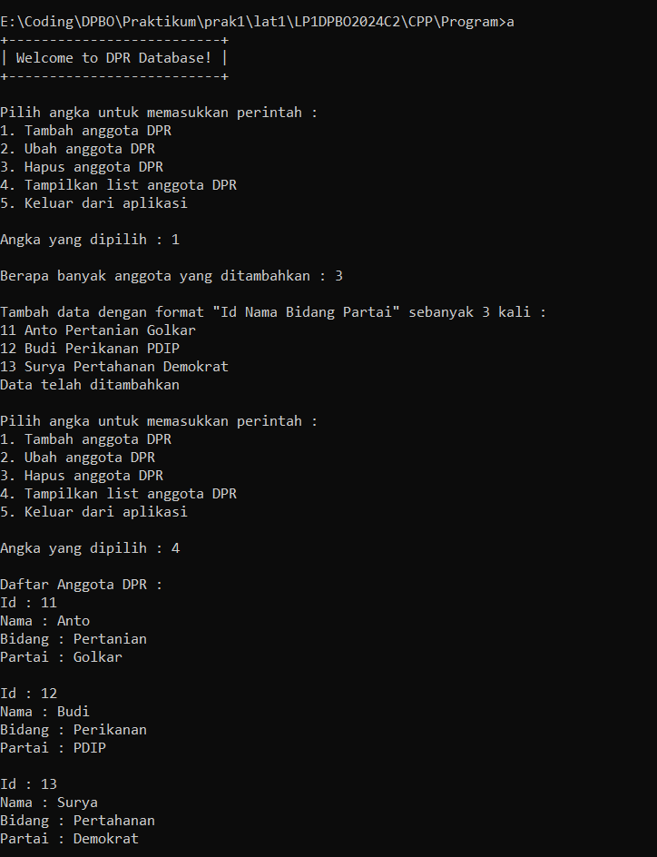
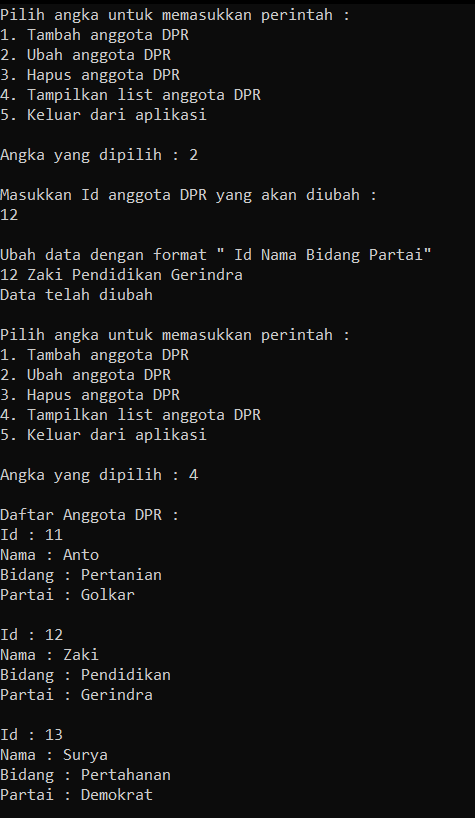
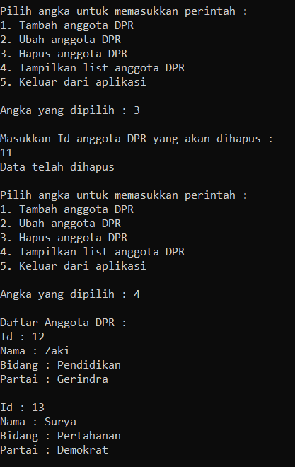
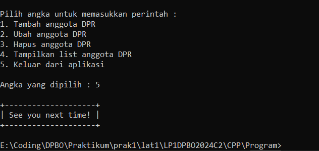
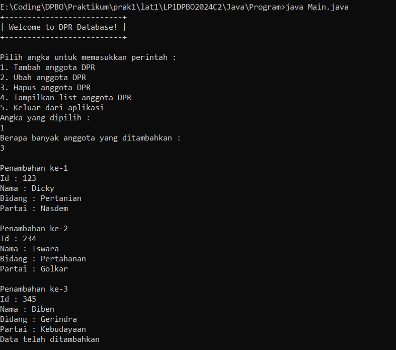
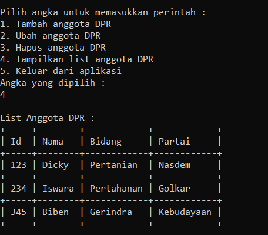
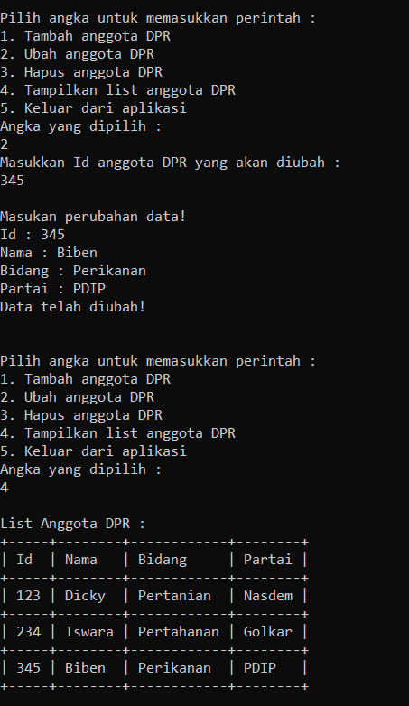
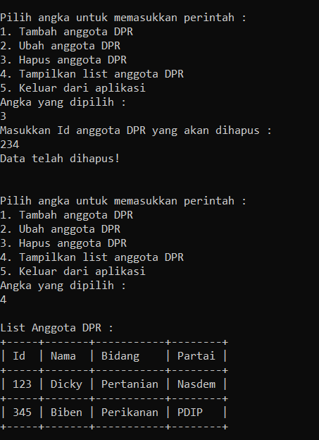
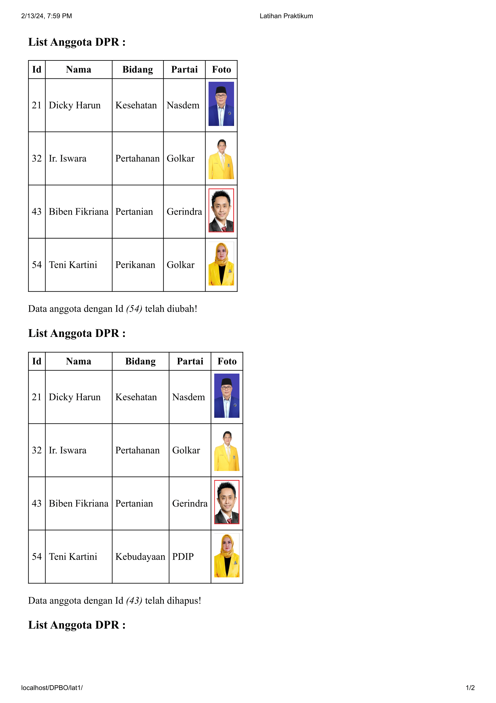
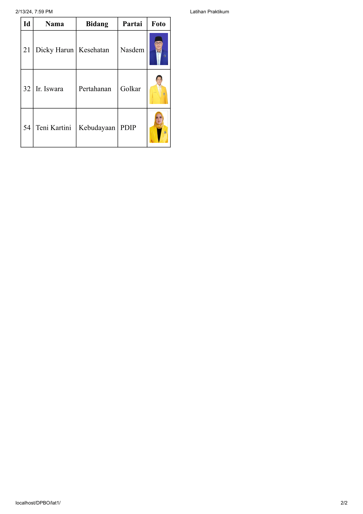

# LP1DPBO2024C2
## Janji
Saya Muhamad Tio Ariyanto [2201718] mengerjakan soal Latihan Praktikum 1 dalam mata kuliah DPBO untuk keberkahanNya maka saya tidak melakukan kecurangan seperti yang telah dispesifikasikan. Aamiin

## Deskripsi Program
Program berbasis OOP menggunakan bahasa pemrograman C++, Java, Python, dan PHP yang menampilkan informasi daftar anggota DPR (sekumpulan objek anggota DPR). Didalam class DPR memiliki 4 Atribut, yaitu :
- Id
- Nama
- Bidang
- Partai

dan tambahan untuk bahasa PHP ada atribut tambahan yaitu
- Foto

Program ini memiliki fitur menambah, mengubah, dan menghapus data.

## Desain Program
Program terdiri dari 2 file, yaitu file untuk kelas dan main. Dimana file kelas berisi kelas Dpr merupakan kelas yang berisi data anggota DPR, terdiri dari atribut id, nama, bidang dan partai dengan hak akses private bertujuan agar atribut tersebut tidak bisa diakses dari luar class. Pada kelas Dpr terdapat method setter dan getter untuk setiap atribut pada kelas tersebut. Hak akses untuk setiap method adalah public, supaya semua method dapat diakses diluar kelas (kelas main).

## Alur Program
Untuk menjalankan programnya, pilih terlebih dahulu bahasa yang akan digunakan lalu run programnya

Pada program ini terdapat 5 pilihan menu, antara lain :
* `Tambah` digunakan untuk menambah data anggota DPR
* `Ganti` digunakan untuk mengubah data anggota DPR
* `Hapus` digunakan untuk menghapus data anggota DPR
* `Tampil` digunakan untuk menampilkan tabel data anggota DPR 
* `Keluar` digunakan untuk keluar dari program

Program ini mempunyai 1 Primary key, Yaitu Id, Oleh karena itu
* ketika ingin menambah data, maka Id harus unik
* ketika ingin mengubah data, maka Id yang dipilih harus ada, jika tidak ada Id, maka data tidak dapat di ubah
* ketika ingin menghapus data, menggunakan Id, jika tidak ada Id yang terdaftar maka data tidak bisa dihapus

## Dokumentasi
### Dokumentasi CPP

### Dokumentasi Java

### Dokumentasi Python

### Dokumentasi PHP

